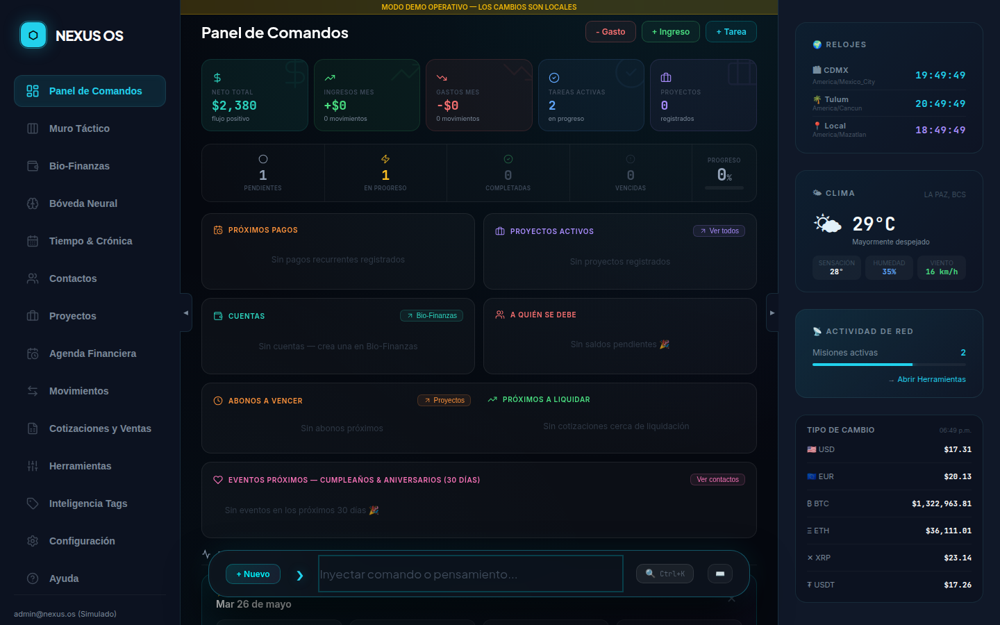
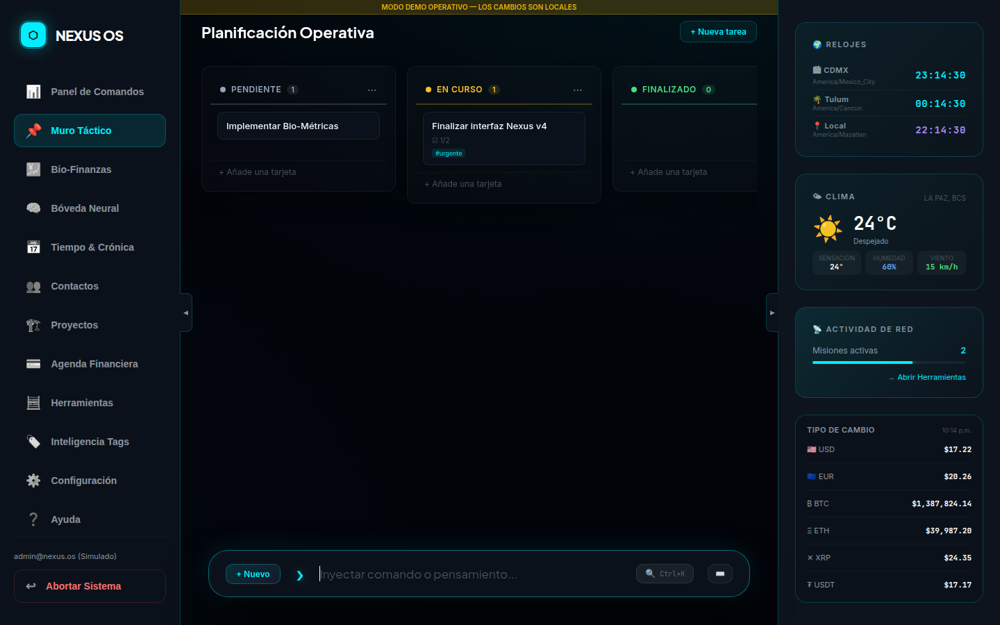
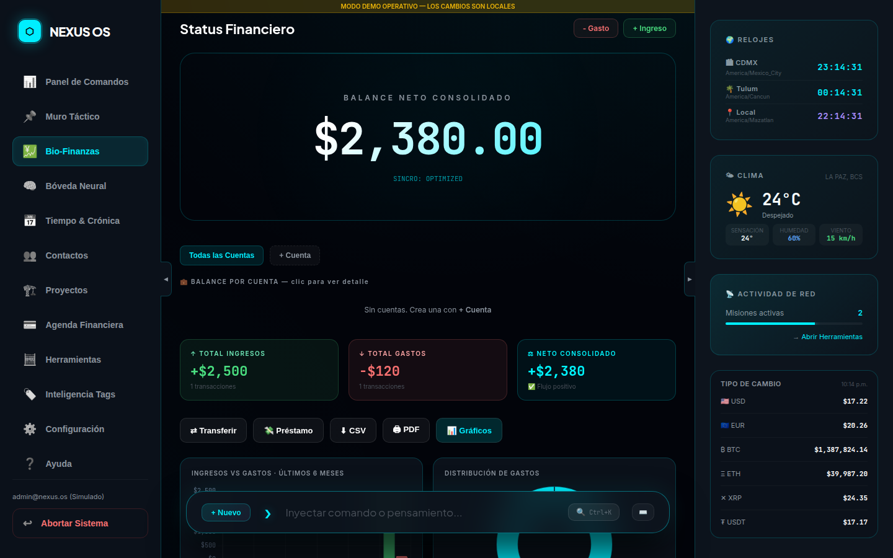
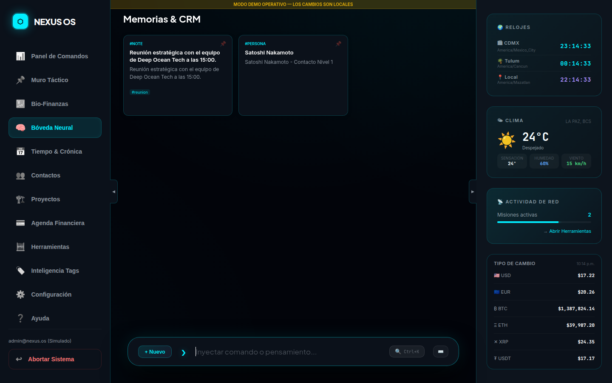
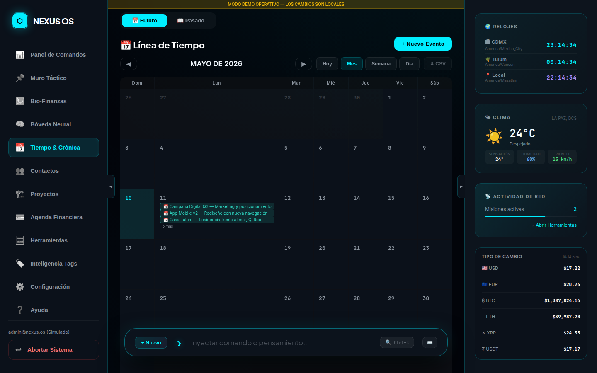
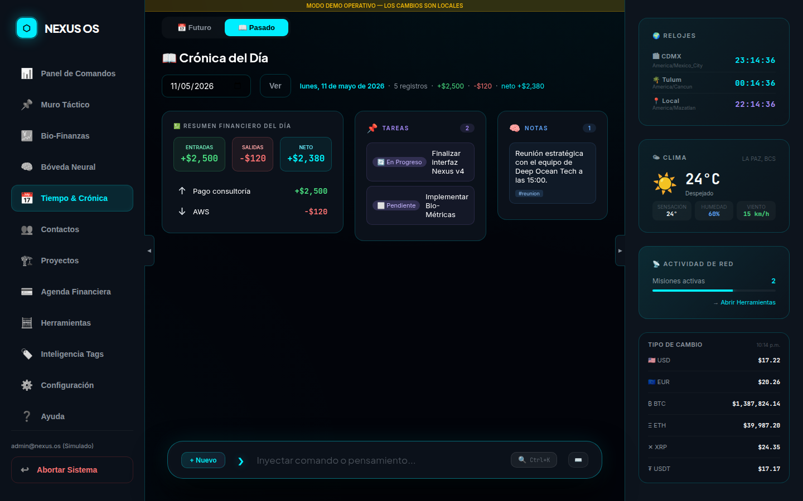
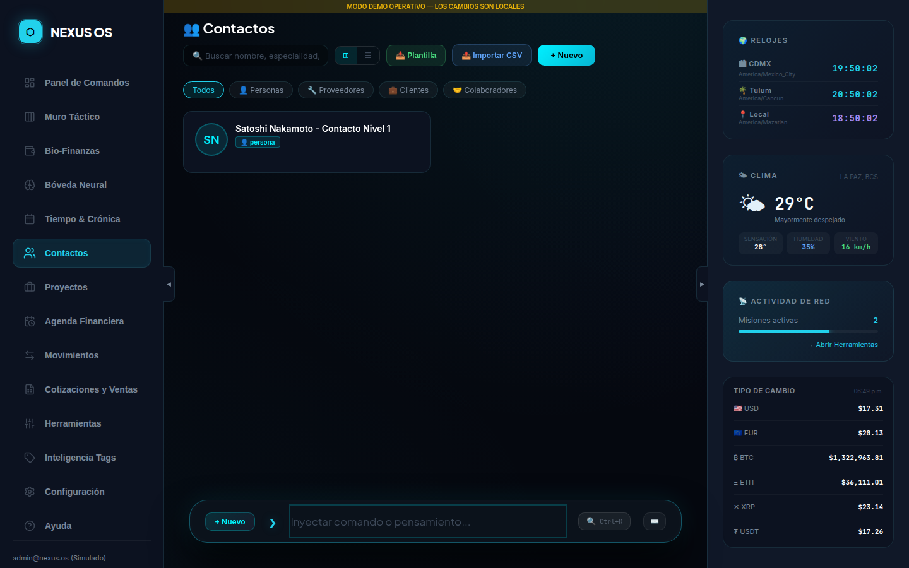
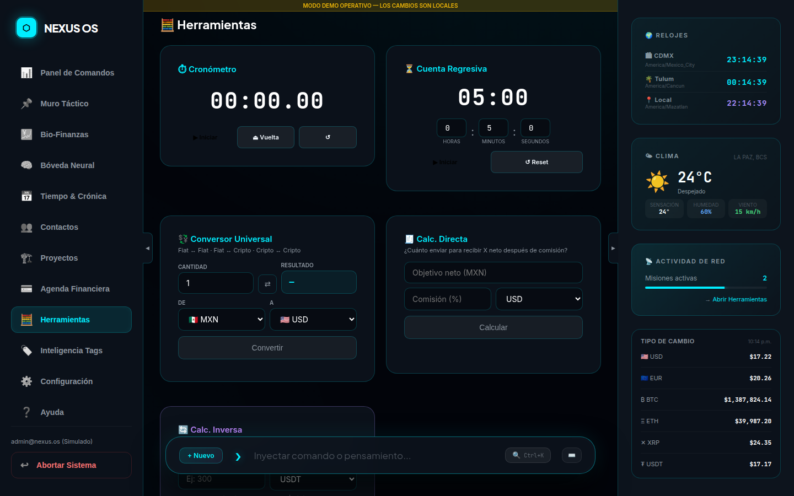

<p align="center">
  
</p>

<h1 align="center">⬡ Nexus OS</h1>

<p align="center">
  <strong>Tu Sistema Operativo Personal — Del Caos Cognitivo a la Inteligencia Situacional Absoluta</strong>
</p>

<p align="center">
  <a href="https://nexus-os-chi.vercel.app">
    
  </a>
</p>

<p align="center">
  
  
  
  
  
  
  
  
</p>

<p align="center">
  <a href="#-características">Características</a> •
  <a href="#-parser-semántico">Parser</a> •
  <a href="#-quick-start">Quick Start</a> •
  <a href="#-deploy-en-vercel">Deploy</a> •
  <a href="#%EF%B8%8F-stack">Stack</a> •
  <a href="#-contacto">Contacto</a>
</p>

---

## 📖 Acerca del Proyecto

**Nexus OS** nació para resolver el problema más silencioso de la productividad moderna: la **fatiga de aplicaciones**. Ideas en notas, tareas en Trello, finanzas en Excel, contactos en otro silo. Cada app consume energía cognitiva y destruye el contexto.

La solución es radical: **Todo es un Nodo.**

Una sola barra de comandos. Un solo sistema. Todo clasificado automáticamente por un **Parser Semántico** en tiempo real que detecta el tipo de información por su contenido y sintaxis — sin configuración, sin formularios.

---

## 🖼️ Capturas de Pantalla

<table>
  <tr>
    <td align="center"><strong>📊 Panel de Comandos</strong><br/></td>
    <td align="center"><strong>📌 Muro Táctico</strong><br/></td>
  </tr>
  <tr>
    <td align="center"><strong>💹 Bio-Finanzas</strong><br/></td>
    <td align="center"><strong>🧠 Bóveda Neural</strong><br/></td>
  </tr>
  <tr>
    <td align="center"><strong>📅 Línea de Tiempo</strong><br/></td>
    <td align="center"><strong>📖 Crónica</strong><br/></td>
  </tr>
  <tr>
    <td align="center"><strong>👥 Contactos & CRM</strong><br/></td>
    <td align="center"><strong>💳 Agenda Financiera</strong><br/></td>
  </tr>
</table>

---

## ✨ Características

### 10 Módulos integrados

| Módulo | Descripción |
|---|---|
| 📊 **Panel de Comandos** | Feed unificado con color-coding por tipo. Filtros por categoría, agrupación, búsqueda global. Actualización optimista — el nodo aparece al instante con animación pulse. |
| 📌 **Muro Táctico** | Kanban completo: 4 columnas drag-and-drop, modal detalle con checklist, miembros, etiquetas de colores, fechas e imágenes adjuntas (Ctrl+V paste). |
| 💹 **Bio-Finanzas** | Multi-cuenta con `@cuenta` en comandos. Saldo independiente por cuenta, gráficas Chart.js, modal por transacción, comentarios, adjuntos y exportación CSV. |
| 🧠 **Bóveda Neural** | Notas estilo Google Keep: 8 colores, pin, edición fullscreen, **Transform Note** (convierte en tarea / ingreso / gasto / evento). |
| 📅 **Línea de Tiempo** | Calendario Mes / Semana / Día con dots por tipo de nodo. Creación de eventos directa y exportación CSV. |
| 📖 **Crónica** | Histórico diario en 3 columnas (tareas · notas · finanzas) con balance neto del día. Navega a cualquier fecha pasada. |
| 👥 **Contactos & CRM** | Agenda con personas, bancos y carteras cripto. Import/Export CSV con plantilla descargable. Ficha detalle con historial de transacciones vinculadas. |
| 💳 **Agenda Financiera** | Tarjetas (banco, titular, número completo, CLABE, sucursal), suscripciones con categorías predefinidas, pagos fijos con contacto beneficiario y método de pago. Plan del Mes con selector de cuentas y disponible real. |
| 🛠️ **Herramientas** | Conversor unificado fiat↔crypto en tiempo real, calculadora inversa (¿cuánto cobrar para recibir X neto?), cronómetro con alertas sonoras, contador regresivo. |
| ❓ **Ayuda & Config** | Guía de uso integrada, atajos de teclado, preferencias de sistema, cambio de contraseña, zona horaria. |

### Funciones transversales

| Función | Detalle |
|---|---|
| 🔐 **Auth segura** | Login / registro con Supabase Auth + JWT + Row Level Security por `owner_id` |
| 🔄 **Actualizaciones optimistas** | Nodo visible al instante; se sincroniza con Supabase en background |
| 📵 **Cola offline** | Si no hay internet, guarda en `localStorage` y sincroniza al reconectar |
| 📎 **Adjuntos** | Imágenes via Ctrl+V o selector; compresión JPEG 0.7 automática. Audio hasta 5 MB |
| 🔍 **Búsqueda global** | Filtra por tags `#etiqueta` o texto libre en todos los módulos |
| 📤 **Print & Export CSV** | Imprime o exporta cualquier vista filtrada |
| 💱 **Tipo de cambio en vivo** | Sidebar con USD/BTC/ETH/XRP/USDT en MXN, actualización cada 60 s |
| 🎨 **Transform Note** | Convierte cualquier nota en tarea, ingreso, gasto o evento con un clic |

---

## ⌨️ Parser Semántico

La barra de comandos inferior clasifica automáticamente cada entrada sin formularios:

```bash
# ─── TAREAS ─────────────────────────────────────────────────────
#tarea Revisar informe Q2
→ { type: "kanban", status: "todo" }

# ─── INGRESOS  (con cuenta asignada) ────────────────────────────
+$15000 @bbva  Pago proyecto freelance
→ { type: "income", amount: 15000, account_id: "bbva" }

# ─── GASTOS  (con cuenta asignada) ──────────────────────────────
-$350 @efectivo  Gasolina #auto
→ { type: "expense", amount: 350, account_id: "efectivo" }

# ─── NOTA LIBRE → Bóveda Neural ─────────────────────────────────
Reflexión sobre el producto #idea #startup
→ { type: "note", tags: ["#idea", "#startup"] }

# ─── CONTACTO / CRM ─────────────────────────────────────────────
#persona Juan Pérez — CEO Startup XYZ
→ { type: "persona" }

# ─── PROYECTO ───────────────────────────────────────────────────
#proyecto Rediseño landing Q3 #diseño
→ { type: "proyecto" }
```

> **Tip:** Escribe `+$` o `-$` y aparece automáticamente un selector de cuentas encima del input para asignar con un clic. El signo `@cuenta` también funciona directamente en el texto.

---

## 🏗️ Arquitectura

```
INPUT DEL USUARIO  (barra de comandos unificada)
        │
        ▼
┌────────────────────────┐
│    Parser Semántico    │  ← Analiza en tiempo real  ← preview live
└────────────────────────┘
        │
        ├── #tarea      → kanban      → Muro Táctico
        ├── +$  @cuenta → income      → Bio-Finanzas
        ├── -$  @cuenta → expense     → Bio-Finanzas
        ├── #persona    → persona     → Bóveda Neural / Contactos
        ├── #proyecto   → proyecto    → Bóveda Neural
        ├── texto libre → note        → Bóveda Neural
        ├── card/sub/bill→ agenda     → Agenda Financiera
        └── contact     → contact     → Contactos & CRM
                                 │
               ┌─────────────────▼──────────────────┐
               │          nodes  (Supabase)          │
               │  id · owner_id · type · metadata{}  │
               │         Row Level Security          │
               └─────────────────┬──────────────────┘
                                 │ Realtime subscription
           ┌─────────────────────┼────────────────────┐
           ▼                     ▼                    ▼
    Panel Comandos          Crónica           Línea de Tiempo
    Muro Táctico          Bio-Finanzas        Bóveda Neural
    Contactos             Agenda Financiera   Herramientas
```

### Estructura del Proyecto

```
nexus-os/
├── index.html              # Landing page + Auth modal
├── app.html                # Dashboard SPA (10 módulos)
├── app.js                  # Core: Parser + CRUD + Renders + Modals (~4 200 líneas)
├── main.js                 # Auth Supabase + animación landing
├── style.css               # Design system "Deep Ocean Tech"
├── reset-password.html     # Flujo reset contraseña
├── tailwind.config.js
├── vite.config.js
├── vercel.json             # Rewrite /app → /app.html
└── assets/
    └── screenshots/        # Capturas de los módulos
```

---

## 🚀 Quick Start

### Prerrequisitos

- Node.js `>= 18` · npm `>= 9`
- Cuenta en [Supabase](https://supabase.com) (plan gratuito funciona)

### 1 — Clonar e instalar

```bash
git clone https://github.com/oscaromargp/nexus-os.git
cd nexus-os
npm install
```

### 2 — Variables de entorno

```bash
cp .env.example .env
```

```env
VITE_SUPABASE_URL=https://tu-proyecto.supabase.co
VITE_SUPABASE_ANON_KEY=tu-anon-key-publica
```

### 3 — Crear la base de datos en Supabase

Abre el **SQL Editor** de Supabase y ejecuta:

```sql
-- Tabla principal (todo es un nodo)
create table if not exists nodes (
  id         uuid primary key default gen_random_uuid(),
  owner_id   uuid references auth.users not null,
  content    text not null,
  type       text not null default 'note',
  metadata   jsonb default '{}',
  created_at timestamptz default now()
);

-- Row Level Security — cada usuario ve solo sus datos
alter table nodes enable row level security;

create policy "user_owns_nodes" on nodes
  for all
  using  (auth.uid() = owner_id)
  with check (auth.uid() = owner_id);

-- Índices de rendimiento
create index if not exists idx_nodes_owner   on nodes (owner_id);
create index if not exists idx_nodes_type    on nodes (type);
create index if not exists idx_nodes_created on nodes (created_at desc);

-- Realtime (opcional — para sincronización en tiempo real)
alter publication supabase_realtime add table nodes;
```

### 4 — Desarrollo local

```bash
npm run dev
# → http://localhost:5173
```

---

## 🚢 Deploy en Vercel

```bash
# 1. Instala la CLI de Vercel (una vez)
npm i -g vercel

# 2. Agrega las variables de entorno en Vercel Dashboard
#    VITE_SUPABASE_URL  y  VITE_SUPABASE_ANON_KEY

# 3. Build + deploy
vercel build --prod
vercel deploy --prod --yes
```

O conecta el repositorio en [vercel.com](https://vercel.com) — el archivo `vercel.json` ya incluye la reescritura `/app → /app.html`.

| Variable | Descripción |
|---|---|
| `VITE_SUPABASE_URL` | URL de tu proyecto Supabase |
| `VITE_SUPABASE_ANON_KEY` | Clave anon pública (segura para el frontend) |

---

## 🛠️ Stack

<p align="left">
  
  
  
  
  
  
  
</p>

| Capa | Tecnología | Propósito |
|---|---|---|
| Frontend | Vite + Vanilla JS ES Modules | Build ultra-rápido, sin framework overhead |
| Estilos | Tailwind CSS + CSS Variables | Design system "Deep Ocean Tech" |
| Backend | Supabase (PostgreSQL + Auth) | BD relacional + Auth + Realtime + RLS |
| Gráficas | Chart.js 4.4.4 | Visualizaciones Bio-Finanzas |
| Deploy | Vercel | Edge CDN global |
| APIs externas | open.er-api.com · @fawazahmed0/currency-api | Tipo de cambio fiat y cripto (gratis, sin key) |

---

## 🤝 Contribuyendo

```bash
# Fork → branch → commit → Pull Request
git checkout -b feature/mi-nueva-funcion
git commit -m 'feat: descripción clara del cambio'
git push origin feature/mi-nueva-funcion
# → Abre un Pull Request en GitHub
```

Convenciones de commits: `feat:` · `fix:` · `refactor:` · `docs:` · `chore:`

---

## 👤 Autor

<p align="center">
  <a href="https://oscaromargp.github.io/Oscaromargp/">
    
  </a>
  <br/>
  <strong>Oscar Omar Gómez Peña</strong>
</p>

<p align="center">
  <a href="https://oscaromargp.github.io/Oscaromargp/">
    
  </a>
  &nbsp;
  <a href="https://github.com/oscaromargp">
    
  </a>
</p>

---

## 💖 Apoya este Proyecto

<p align="center">
  <strong>Donaciones en Criptomonedas — Red XRP</strong><br/><br/>
  
</p>

> `rBthUCndKy3Xbb19Ln4xkZeMwusX9NrYfj`

---

## 📄 Licencia

Distribuido bajo la licencia [MIT](LICENSE).

---

## 🙏 Agradecimientos

<p align="center">
  <em>
    "Porque Dios es el que en vosotros produce<br/>
    así el querer como el hacer,<br/>
    por su buena voluntad."
  </em><br/>
  <strong>— Filipenses 2:13</strong><br/><br/>
  A Dios, toda la gloria.
</p>

---

<p align="center">
  <a href="https://supabase.com">Supabase</a> ·
  <a href="https://vitejs.dev">Vite</a> ·
  <a href="https://shields.io">Shields.io</a> ·
  <a href="https://vercel.com">Vercel</a> ·
  <a href="https://nexus-os-chi.vercel.app">🚀 Demo en vivo</a>
</p>
