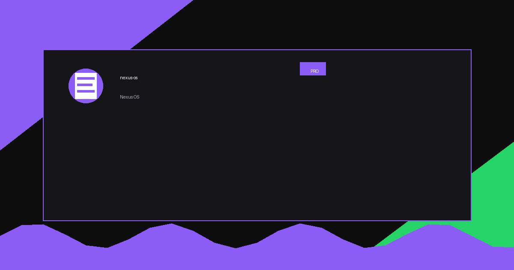
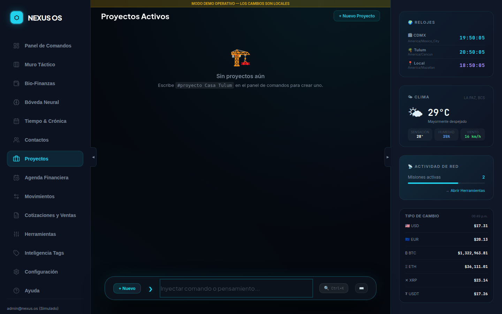
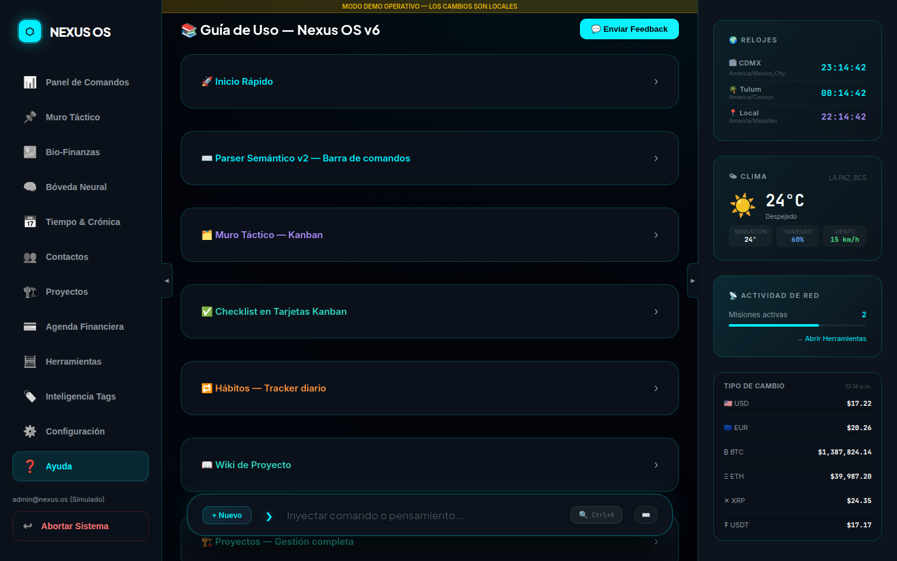
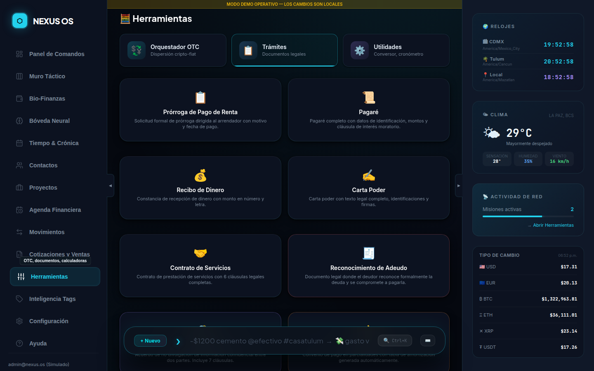

<p align="center">
  
</p>

<h1 align="center">Nexus OS</h1>

<p align="center">
  <strong>Dashboard personal all-in-one con parser semántico de lenguaje natural.<br/>
  Escribe como piensas — el sistema clasifica, registra y organiza solo.</strong>
</p>

<p align="center">
  
  
  
  
  
  
</p>

<p align="center">
  <a href="#-acerca-del-proyecto">Acerca</a> •
  <a href="#-novedades-v240">Novedades</a> •
  <a href="#-características">Características</a> •
  <a href="#-vistas-del-sistema">Vistas</a> •
  <a href="#-demo">Demo</a> •
  <a href="#-sintaxis-del-parser">Parser</a> •
  <a href="#-comenzando">Comenzando</a> •
  <a href="#-estructura-del-proyecto">Estructura</a> •
  <a href="#-deploy">Deploy</a> •
  <a href="#-contacto">Contacto</a>
</p>

---

## 🆕 Novedades v2.4.0

### Centro de Trámites — 10 Plantillas Legales

El módulo de documentos legales ahora cuenta con **10 plantillas** completamente funcionales (antes 5):

| # | Plantilla | Descripción |
|---|---|---|
| 1 | 📋 Prórroga de Pago de Renta | Solicitud formal al arrendador con motivo y fecha |
| 2 | 📜 Pagaré | Título de crédito con CURP/RFC/electoral y tabla de pagos en serie |
| 3 | 💰 Recibo de Dinero | Constancia con monto en número y letra, datos de identificación completos |
| 4 | ✍️ Carta Poder | Poder especial con 14 facultades seleccionables y testigos |
| 5 | 🤝 Contrato de Servicios | Contrato con 6+ cláusulas, vinculación a cotización, exportación DOC |
| 6 | 🧾 Reconocimiento de Adeudo | El deudor reconoce formalmente la deuda y fecha de pago |
| 7 | 🔏 NDA / Confidencialidad | Acuerdo de no divulgación con 7 cláusulas legales completas |
| 8 | 🤙 Convenio de Pago | Convenio en parcialidades con **tabla de amortización automática** |
| 9 | 🔧 Orden de Servicio | Autorización de trabajo técnico con costo y firma de conformidad |
| 10 | 📦 Carta Responsiva | Entrega de bienes en comodato con compromisos del responsable |

### Mejoras al módulo de Trámites

- **Forma de pago → Dropdown**: 9 opciones predefinidas (ya no texto libre)
- **Cotización vinculada en Contrato**: pre-llena descripción, monto y cliente automáticamente desde Cotizaciones
- **PDF Contrato**: cláusula OBJETO menciona el presupuesto/folio vinculado (Anexo A)
- **Exportación DOC**: descarga Word editable para Contrato y Carta Poder
- **Form Persistence**: al exportar un PDF se guarda snapshot del formulario → botón **✏️ Editar** en el historial
- **Auto-fill genérico**: todos los formularios nuevos rellenan datos desde tus contactos en un clic

---

## 📖 Acerca del Proyecto

<p align="center">
  
</p>

**Nexus OS** es un sistema operativo personal que vive en el navegador. Nació de una pregunta simple: *¿y si no tuvieras que decidir dónde guardar algo?* Solo escribes — el parser semántico detecta si es una tarea, un gasto, un ingreso, una nota o un evento, y lo enruta automáticamente a la vista correcta.

Todo en Nexus OS es un **Nodo** (`{type, content, metadata}`). Esto permite que una sola entrada fluya entre vistas: una nota puede convertirse en tarea, un gasto en evento del calendario, una cotización en proyecto activo — sin copiar, sin pegar, sin cambiar de app.

### 🛠️ Construido Con

<p align="left">
  
  
  
  
  
  
  
  
  
  
  
</p>

---

## ✨ Características

| Característica | Descripción |
|---|---|
| ⚡ **Parser semántico** | Detecta tipo de entrada por prefijos: `#tarea`, `-$gasto @cuenta`, `+$ingreso @cuenta`, `#persona`, `#proyecto` |
| 🏗️ **Everything is a Node** | Un único modelo de datos fluye entre todas las vistas del sistema |
| 🔄 **Transform Note** | Convierte cualquier nodo en otro tipo sin perder datos (`nota → tarea`, `gasto → evento`) |
| 🔒 **Auth completa** | Login/registro con Supabase Auth — cada usuario solo ve sus propios datos (RLS) |
| 🖼️ **Adjuntos con Ctrl+V** | Pega imágenes directamente desde el portapapeles con compresión automática |
| 🔍 **Búsqueda global** | Fuzzy search con Fuse.js sobre todo el contenido, filtros por tipo y tag |
| 📊 **Dashboard ejecutivo** | KPIs tintados por tipo, próximos pagos con estado, distribución Kanban, abonos a vencer |
| 📅 **Pagos recurrentes avanzados** | Frecuencias: mensual · bimestral · trimestral · semestral · anual · bianual · trianual |
| ⚡ **Filtros rápidos** | Filtra movimientos por Todos / Ingresos / Gastos / Pendientes con un clic |
| 🟢 **Semáforo financiero** | Badge visual por tipo en cada fila: ingreso · gasto · evento · nota |
| 🎨 **Visual Upgrade** | Lucide Icons (~80), DaisyUI v5, micro-interacciones spring, tooltips glassmorphism |
| 💫 **Micro-interacciones** | Cards con lift on hover, botones con press scale, modales con slide-in, toasts animados |
| 📤 **Print / Export CSV** | Exporta transacciones y movimientos financieros en un clic |
| 📱 **PWA-ready** | Diseño responsivo, usable en móvil y tablet |
| 🎨 **Editor rico** | Bóveda Neural con colores de texto, resaltado, tamaños XS–3X y formato completo |
| 👤 **Ficha de contacto** | Perfil de página completa con tabs (Info/Docs/Pagos/Proyectos), foto, documentos |
| 💎 **Portafolio Crypto** | Seguimiento multi-moneda con edición de compras y precio actual |
| 📊 **Orquestador OTC** | Calculadora cripto-fiat con dispersión bancaria, semáforo, WhatsApp, PDF ejecutivo |
| 📜 **10 Plantillas Legales** | Documentos jurídicos con auto-fill desde contactos, export PDF y Word editable |
| 📋 **Form Persistence** | Guarda snapshot del formulario → re-abre con ✏️ Editar para re-exportar |
| 🤙 **Amortización automática** | Convenio de Pago genera tabla de cuotas por fecha y monto automáticamente |
| 🪙 **Bitso real-time** | Precio de venta USDT/BTC/ETH/XRP/SOL desde API Bitso en el OTC |
| 📋 **Histórico legal** | Documentos generados se guardan como nodos — busca, edita, reimprime o elimina |

---

## 🗂️ Vistas del Sistema

Nexus OS tiene **9 vistas** accesibles desde la barra lateral:

| # | Vista | Descripción |
|---|---|---|
| 1 | 🖥️ **Panel de Comandos** | Dashboard ejecutivo con KPIs, próximos pagos, distribución de tareas Kanban, proyectos expandibles con deuda |
| 2 | 🗂️ **Muro Táctico** | Kanban drag & drop (Pendiente / En Progreso / Hecho). Modal de detalle por tarjeta |
| 3 | 💰 **Bio-Finanzas** | KPIs de cotizaciones, gráficos Chart.js (bar/donut/línea), mini-calendario financiero, filtros rápidos y semáforo visual 🟢🔴🟡 |
| 4 | 🧠 **Bóveda Neural** | Notas estilo Google Keep con editor de página completa, colores, etiquetas, pin y recordatorios |
| 5 | 📅 **Calendario** | Línea de tiempo con vistas mes / semana / día, sincronizado con tareas y eventos |
| 6 | 📜 **Crónica** | Histórico diario en 3 columnas: lo que pasó, decisiones tomadas, pendientes |
| 7 | 👥 **Contactos** | Directorio con ficha completa: foto, teléfonos, documentos, WhatsApp, historial de pagos |
| 8 | 🧮 **Herramientas** | Orquestador OTC, Centro de Trámites (10 plantillas), Utilidades |
| 9 | ❓ **Ayuda** | Guía interactiva completa de la sintaxis del parser y todas las funciones |

---

## 🎬 Demo

<p align="center">
  
</p>

> ¿No puedes ver el GIF? Revisa las capturas de pantalla por vista más abajo.

### 📸 Capturas por vista

<p align="center">
  
  &nbsp;&nbsp;
  
</p>

<p align="center">
  
  &nbsp;&nbsp;
  
</p>

<p align="center">
  
  &nbsp;&nbsp;
  
</p>

<p align="center">
  
  &nbsp;&nbsp;
  
</p>

<p align="center">
  
  &nbsp;&nbsp;
  
</p>

### 📄 Centro de Trámites — 10 Plantillas Legales

<p align="center">
  
</p>

*Todos los formularios se auto-llenan desde tu directorio de contactos (nombre, RFC, CLABE, domicilio). Los documentos se guardan en el historial y pueden re-editarse y re-exportarse en cualquier momento.*

---

## 👤 Contactos — Ficha Completa

El módulo de contactos es un **CRM ligero** integrado con el resto del sistema:

### Datos del contacto
- **Foto de perfil** — URL (Google Drive, Dropbox) o subir archivo (compresión automática + Supabase Storage)
- **Múltiples teléfonos** — con etiqueta (Personal, Trabajo, WhatsApp, Casa, Otro)
- **Múltiples emails** — con etiqueta (Personal, Trabajo, Facturación, Otro)
- **Dirección postal** — calle, C.P., estado, país
- **Fechas especiales** — 🎂 Cumpleaños y 💑 Aniversario
- **Cuentas de cobro** — CLABE, wallet crypto, efectivo (con botón copiar)
- **Roles** — Persona, Proveedor, Cliente, Colaborador (multi-selección)
- **Calificación** — 1 a 5 estrellas
- **Especialidades** — catálogo editable

### 📎 Documentos vinculados

| Tipo | Descripción |
|---|---|
| 🪪 INE / Credencial | Identificación oficial |
| 📋 CURP | Clave Única de Registro de Población |
| 📜 Acta de Nacimiento | Documento de nacimiento |
| 🛂 Pasaporte | Documento de viaje |
| 🧾 RFC / SAT | Registro fiscal |
| 📝 Contrato | Acuerdo de trabajo o servicios |
| ✍️ Firma | Rúbrica digitalizada |
| ⚖️ Poder Notarial | Representación legal |
| 🏠 Comprobante de Domicilio | Dirección verificada |
| 📷 Fotografía | Foto adicional |

---

## 🧮 Herramientas — Orquestador OTC + Centro de Trámites

El módulo se organiza en **3 tabs**:

### Tab 1: 📊 Orquestador OTC

Calculadora de operaciones cripto-fiat con dispersión bancaria inteligente:

| Bloque | Función |
|---|---|
| **Entrada de Operación** | Moneda, cantidad, T/C Bitso real-time, comisión reportada vs. real |
| **KPI Cards (2×2)** | Venta bruta, comisión cliente, neto a dispersar, ganancia operador |
| **Tabla de Dispersión** | Beneficiarios con autocomplete, Banco/CLABE auto-fill, monto fijo o % |
| **Semáforo** | Barra visual: 🟡 <100% · 🟢 100% · 🔴 >100% |
| **Mensaje WhatsApp** | Texto de pre-aprobación con dispersión completa |
| **Export PDF** | Estado de cuenta ejecutivo con KPIs, tabla y comprobantes |

### Tab 2: 📄 Centro de Trámites y Plantillas (v2.4.0)

**10 documentos legales** listos para usar:

| Plantilla | Auto-fill contactos | Export PDF | Export DOC | Tabla amortización |
|---|:---:|:---:|:---:|:---:|
| Prórroga de Renta | ✅ | ✅ | — | — |
| Pagaré | ✅ | ✅ | — | — |
| Recibo de Dinero | ✅ | ✅ | — | — |
| Carta Poder | ✅ | ✅ | ✅ | — |
| Contrato de Servicios | ✅ | ✅ | ✅ | — |
| Reconocimiento de Adeudo | ✅ | ✅ | — | — |
| NDA / Confidencialidad | ✅ | ✅ | — | — |
| Convenio de Pago | ✅ | ✅ | — | ✅ |
| Orden de Servicio | ✅ | ✅ | — | — |
| Carta Responsiva | ✅ | ✅ | — | — |

**Características del motor de documentos:**
- Todos los formularios se rellenan automáticamente desde tus **Contactos** (nombre, RFC, domicilio, CLABE)
- **Folio único** generado por documento (`NX-YYYYMMDD-XXXX`)
- **Justificación tipográfica** en el cuerpo legal (texto a dos columnas como notaría)
- **Regla MXN**: montos siempre en MXN como primario; USDT/USD solo como referencia comercial
- **Form snapshot**: al exportar, guarda todos los valores del formulario → botón **✏️ Editar** para re-exportar con cambios
- **Catálogo de cláusulas**: crea y reutiliza cláusulas personalizadas en cualquier contrato

### Tab 3: 🛠 Utilidades

Cronómetro, Cuenta Regresiva, Conversor Universal (Fiat ↔ Crypto), Calculadora Directa e Inversa.

---

## ⌨️ Sintaxis del Parser

El campo de entrada principal acepta lenguaje natural. El parser detecta automáticamente el tipo:

```
# Tareas / Kanban
#tarea reunión con cliente el viernes a las 10am
#proyecto rediseño web — para crear un proyecto nuevo

# Finanzas — gastos (con cuenta destino)
-$500 cena con equipo @efectivo
-$1200 renta mensual @banco
-$350.50 gasolina @tarjeta

# Finanzas — ingresos (con cuenta origen)
+$8000 sueldo quincenal @banco
+$2500 freelance logo @paypal @#proyecto-web

# Notas libres (todo lo demás)
recordar revisar el servidor mañana
idea: hacer una landing page para el cliente

# Personas / contactos
#persona Juan García — diseñador UX

# Cotizaciones
#cotizacion logo + branding $4500 @cliente-abc
```

### Modificadores de cuentas

| Prefijo | Tipo | Ejemplo |
|---|---|---|
| `-$monto @cuenta` | Gasto | `-$200 uber @efectivo` |
| `+$monto @cuenta` | Ingreso | `+$5000 proyecto @banco` |
| `@cuenta` sin monto | Tag de referencia | `@tarjeta` en cualquier nodo |

### Modificadores de fecha (chrono-node)

```
#tarea entregar propuesta mañana
#tarea llamar al cliente el lunes a las 9
#tarea pago de renta el 1 de cada mes
```

### Filtros de búsqueda

```
tipo:tarea                — solo tareas
tipo:gasto @efectivo      — gastos de una cuenta
#etiqueta                 — nodos con un tag específico
```

---

## 🚀 Comenzando

### Prerrequisitos

- [Node.js](https://nodejs.org/) >= 18
- Cuenta en [Supabase](https://supabase.com) (gratuita)
- Cuenta en [Vercel](https://vercel.com) (gratuita, opcional para deploy)

### 1. Clonar el repositorio

```sh
git clone https://github.com/oscaromargp/nexus-os.git
cd nexus-os
```

### 2. Instalar dependencias

```sh
npm install
```

### 3. Crear el proyecto en Supabase

1. Ve a [supabase.com](https://supabase.com) → crea un proyecto nuevo
2. En el **SQL Editor**, ejecuta esta migración completa:

```sql
-- ============================================================
-- NEXUS OS — Schema v2.0
-- Ejecutar en: Supabase > SQL Editor
-- ============================================================

CREATE EXTENSION IF NOT EXISTS "uuid-ossp";

-- Tabla principal: todos los datos son nodos
CREATE TABLE IF NOT EXISTS public.nodes (
  id           UUID        PRIMARY KEY DEFAULT uuid_generate_v4(),
  owner_id     UUID        NOT NULL REFERENCES auth.users(id) ON DELETE CASCADE,
  content      TEXT        NOT NULL,
  type         TEXT        NOT NULL DEFAULT 'note'
                           CHECK (type IN (
                             'note','task','income','expense','kanban',
                             'persona','proyecto','cotizacion','milestone',
                             'bill','subscription','calendar','feedback'
                           )),
  metadata     JSONB       NOT NULL DEFAULT '{}'::jsonb,
  created_at   TIMESTAMPTZ NOT NULL DEFAULT NOW()
);

-- Índices para performance
CREATE INDEX IF NOT EXISTS idx_nodes_owner_id ON public.nodes (owner_id);
CREATE INDEX IF NOT EXISTS idx_nodes_type     ON public.nodes (type);
CREATE INDEX IF NOT EXISTS idx_nodes_metadata ON public.nodes USING gin (metadata);

-- Row Level Security — cada usuario solo ve sus nodos
ALTER TABLE public.nodes ENABLE ROW LEVEL SECURITY;

CREATE POLICY "nodes_select_own" ON public.nodes
  FOR SELECT USING (auth.uid() = owner_id);
CREATE POLICY "nodes_insert_own" ON public.nodes
  FOR INSERT WITH CHECK (auth.uid() = owner_id);
CREATE POLICY "nodes_update_own" ON public.nodes
  FOR UPDATE USING (auth.uid() = owner_id)
  WITH CHECK (auth.uid() = owner_id);
CREATE POLICY "nodes_delete_own" ON public.nodes
  FOR DELETE USING (auth.uid() = owner_id);
```

3. En **Settings → API**, copia tu `Project URL` y `anon public key`

### 4. Configurar variables de entorno

```sh
cp .env.example .env
```

Edita `.env`:

```env
VITE_SUPABASE_URL=https://tu-proyecto.supabase.co
VITE_SUPABASE_ANON_KEY=tu-anon-key-aqui
```

### 5. Iniciar en desarrollo

```sh
npm run dev
```

Abre [http://localhost:5173](http://localhost:5173) — crea tu cuenta y empieza a escribir.

---

## 📁 Estructura del Proyecto

```
nexus-os/
├── app.js                  # Lógica principal — parser, render engine, todas las vistas (~21 000 líneas)
├── app.html                # Shell HTML — estructura de vistas, modales y estilos (~3 000 líneas)
├── main.js                 # Entry point Vite — Supabase init, auth, router
├── style.css               # Design tokens y clases base (complementa Tailwind)
├── index.html              # Landing / login page
├── reset-password.html     # Flujo de recuperación de contraseña
├── src/
│   ├── parser.js           # Parser semántico v2 — detecta tipos, fechas, montos
│   ├── finance-engine.js   # Motor financiero — balances, running balance, periodos
│   ├── pdf-reports.js      # Motor de PDFs (jsPDF) — reportes + 10 plantillas legales
│   ├── logic.js            # Lógica auxiliar compartida
│   └── __tests__/          # Tests unitarios (Vitest)
├── vite.config.js          # Config Vite (multi-page)
├── tailwind.config.js      # Config Tailwind + DaisyUI + tailwindcss-animate
├── vercel.json             # Config deploy Vercel (SPA routing)
├── docs/
│   └── database_schema.md  # Esquema SQL completo documentado
├── assets/
│   ├── banner.png          # Banner del proyecto
│   └── screenshots/        # Capturas por vista (01 a 10)
└── .env.example            # Plantilla de variables de entorno
```

### Funciones principales en `app.js`

| Función | Vista / Módulo |
|---|---|
| `renderPanelDashboard()` | Panel de Comandos — KPIs, pagos, distribución Kanban |
| `renderKanban()` | Muro Táctico — board Kanban drag & drop |
| `renderFinance()` | Bio-Finanzas — cuentas, transacciones, semáforo |
| `renderNotes()` | Bóveda Neural — grilla o editor full-page |
| `renderCalendar()` | Calendario / Línea de Tiempo |
| `renderCronica()` | Crónica — histórico diario |
| `renderContacts()` | Contactos — tarjetas del directorio |
| `openDocGen(type)` | Generador de documentos — abre formulario por tipo |
| `docGenFillParty()` | Auto-fill genérico desde contacto seleccionado |
| `docGenLinkCotizacion()` | Pre-popula contrato con datos de cotización vinculada |
| `editDoc(id)` | Reabre formulario con snapshot guardado para re-editar |
| `pdfReconocimientoAdeudo()` | PDF: Reconocimiento de Adeudo |
| `pdfNDA()` | PDF: NDA / Acuerdo de Confidencialidad |
| `pdfConvenioPago()` | PDF: Convenio de Pago con tabla de amortización |
| `pdfOrdenServicio()` | PDF: Orden de Servicio |
| `pdfCartaResponsiva()` | PDF: Carta Responsiva de bien entregado |
| `otcRecalc()` | Motor de cálculo OTC con truncamiento a 2 decimales |
| `otcFetchBitso()` | Consulta precio Bitso real-time |

### Funciones PDF en `src/pdf-reports.js`

| Función | Documento |
|---|---|
| `pdfProrroga(data, emisor)` | Prórroga de Pago de Renta |
| `pdfPagare(data, emisor)` | Pagaré |
| `pdfRecibo(data, emisor)` | Recibo de Dinero |
| `pdfCartaPoder(data, emisor)` | Carta Poder |
| `pdfContratoServicios(data, emisor)` | Contrato de Servicios |
| `pdfReconocimientoAdeudo(data, emisor)` | Reconocimiento de Adeudo *(nuevo v2.4)* |
| `pdfNDA(data, emisor)` | NDA / Confidencialidad *(nuevo v2.4)* |
| `pdfConvenioPago(data, emisor)` | Convenio de Pago en Parcialidades *(nuevo v2.4)* |
| `pdfOrdenServicio(data, emisor)` | Orden de Servicio *(nuevo v2.4)* |
| `pdfCartaResponsiva(data, emisor)` | Carta Responsiva *(nuevo v2.4)* |

---

## ☁️ Deploy

### Deploy en Vercel (recomendado)

```sh
# Instala Vercel CLI si no lo tienes
npm i -g vercel

# Deploy desde el directorio del proyecto
vercel --prod
```

**Variables de entorno en Vercel:**

Ve a tu proyecto en [vercel.com](https://vercel.com) → **Settings → Environment Variables** y agrega:

```
VITE_SUPABASE_URL      = https://tu-proyecto.supabase.co
VITE_SUPABASE_ANON_KEY = tu-anon-key-aqui
```

El archivo `vercel.json` ya está configurado para manejar el routing de SPA:

```json
{
  "rewrites": [{ "source": "/(.*)", "destination": "/index.html" }]
}
```

### Build manual

```sh
npm run build   # Genera /dist
npm run preview # Preview local del build
```

---

## 🤝 Contribuyendo

¡Las contribuciones son bienvenidas! Si tienes ideas, mejoras o encuentras un bug:

1. Haz un fork del repositorio
2. Crea tu rama: `git checkout -b feature/mi-mejora`
3. Haz commit: `git commit -m 'feat: descripción clara del cambio'`
4. Push: `git push origin feature/mi-mejora`
5. Abre un Pull Request describiendo el cambio y por qué lo propones

**Guía de tipos de commit:**

| Prefijo | Uso |
|---|---|
| `feat:` | Nueva funcionalidad |
| `fix:` | Corrección de bug |
| `style:` | Cambios visuales / CSS |
| `refactor:` | Refactorización sin cambio de comportamiento |
| `docs:` | Documentación |

---

## 💖 Apoya este Proyecto

Si Nexus OS te fue útil o te ahorró tiempo, considera hacer una contribución. Esto me ayuda a seguir creando herramientas de código abierto.

<p align="center">
  <strong>Donaciones en Criptomonedas — Red XRP</strong><br><br>
  
</p>

> Dirección XRP: `rBthUCndKy3Xbb19Ln4xkZeMwusX9NrYfj`

---

## 📄 Licencia

Distribuido bajo la licencia MIT. Consulta el archivo [LICENSE](LICENSE) para más información.

---

## 📬 Contacto

<p align="center">
  <strong>Oscar Omar Gómez Peña</strong>
</p>

<p align="center">
  <a href="https://oscaromargp.github.io/Oscaromargp/">
    
  </a>
  &nbsp;
  <a href="https://github.com/oscaromargp">
    
  </a>
</p>

<p align="center">
  <a href="https://github.com/oscaromargp/nexus-os">Ver Repositorio</a> &nbsp;·&nbsp;
  <a href="https://nexus-os-chi.vercel.app">Ver Demo en Vivo</a>
</p>

---

## 👥 Contribuidores

<a href="https://github.com/oscaromargp">
  
</a>

---

## 🙏 Agradecimientos

<p align="center">
  <br/>
  <em>
    "Porque Dios es el que en vosotros produce<br/>
    así el querer como el hacer,<br/>
    por su buena voluntad."
  </em>
  <br/>
  <strong>— Filipenses 2:13</strong>
  <br/><br/>
  Todo lo que aquí existe nació primero como un deseo en el corazón.<br/>
  Cada proyecto, cada línea, cada idea que toma forma —<br/>
  es un regalo de Aquel que nos dio tanto el sueño como la fuerza de alcanzarlo.<br/>
  <strong>A Dios, toda la gloria.</strong>
  <br/>
</p>

---

- [Supabase](https://supabase.com) — por el backend serverless y la autenticación
- [Vite](https://vitejs.dev) — por el tooling de desarrollo ultrarrápido
- [jsPDF](https://github.com/parallax/jsPDF) — por el motor de generación de PDFs
- [jspdf-autotable](https://github.com/simonbengtsson/jsPDF-AutoTable) — por las tablas en PDF
- [Lucide](https://lucide.dev) — por el sistema de iconos SVG consistente (~80 iconos usados)
- [DaisyUI](https://daisyui.com) — por los componentes CSS (badges, tooltips, skeletons)
- [tailwindcss-animate](https://github.com/jamiebuilds/tailwindcss-animate) — por las clases de animación spring
- [Fuse.js](https://fusejs.io) — por el fuzzy search
- [Chrono-node](https://github.com/wanasit/chrono) — por el reconocimiento de fechas naturales
- [SortableJS](https://sortablejs.github.io/Sortable/) — por el drag & drop del Kanban
- [Chart.js](https://www.chartjs.org) — por los gráficos interactivos (donut, barras, líneas)
- [Shields.io](https://shields.io) — por los badges
- [Bitso API](https://bitso.com/api_info) — por los precios crypto en tiempo real
